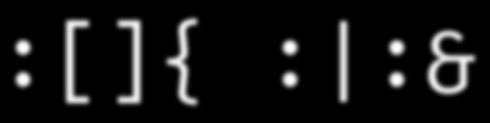

<h1 align="center">Hi there👋, I'm Subhasish aka methedjangoguy</h1>
<h3 align="center">A passionate software developer from India.</h3>

  

- 🌱 I’m currently learning everything 🤣

- 💬 Ask me about **Dot net, Python, Machine Learning, Angular**

- 📫 How to reach me **subhamsv96@gmail.com**

- ⚡ Fun fact **I think I am funny.**

<h3 align="left">Connect with me:</h3>

&nbsp;&nbsp;

&nbsp;&nbsp;

---
<h3 align="left">Languages and Tools:</h3>

 

 &nbsp;
 &nbsp;
 &nbsp;
 &nbsp;
 &nbsp;
 &nbsp;
 &nbsp;
 &nbsp;
 &nbsp;
 &nbsp;
 &nbsp;
 &nbsp;
 &nbsp;
 &nbsp;
 &nbsp;
 &nbsp;
 &nbsp;
 &nbsp;
 &nbsp;
 &nbsp;
 &nbsp;
 &nbsp;

---
>Keep Smiling and work harder.
